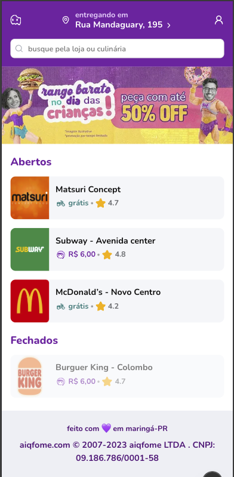
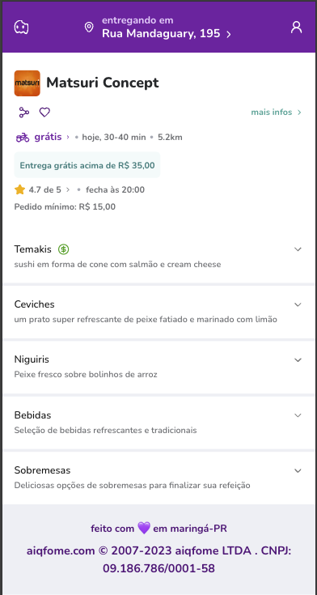
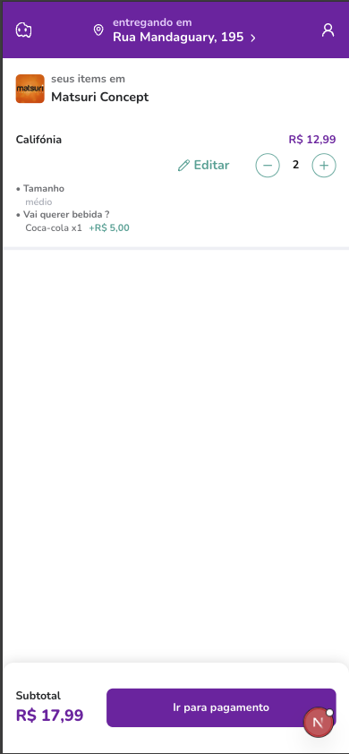

# aiqfome challenge

O projeto simula um aplicativo de delivery de comida, utilizando um arquivo `data.json` como fonte de dados mockada. As rotas de API foram configuradas para acessar esse arquivo, reproduzindo o comportamento de um BFF (Backend for Frontend). Os services da aplicação consomem essas rotas de API, permitindo o acesso estruturado aos dados simulados.

Na tela inicial, os estabelecimentos são listados e organizados por status de "aberto" ou "fechado". Ao clicar em um estabelecimento, o usuário é redirecionado para uma rota que lista todos os produtos disponíveis naquele local.

É possível adicionar ou remover produtos do carrinho. A rota `/ticket` exibe o resumo completo do pedido, incluindo os itens selecionados e o valor total calculado dinamicamente.

# Tecnologias utilizadas:

- NextJS
- TailwindCSS
- TypeScript
- ShadcnUI
- Axios

## 🚀 Decisões técnicas

- **App Router do Next.js**: Utilizei o novo sistema de rotas do Next 13+ para explorar Server Components e layouts aninhados.
- **Tailwind + ShadcnUI**: Para estilização rápida, responsiva e com boa acessibilidade por padrão.
- **Arquitetura em camadas (services, infra, view)**: Escolha pensada para facilitar a escalabilidade e testabilidade do projeto, simulando práticas de projetos reais.
- **Consumo da API via Axios + Adapter Pattern**: Seguindo boas práticas de desacoplamento, criei uma camada que permite trocar a lib de requisição futuramente sem afetar os services.
- **Context API para o header**: Permite comunicação simples e reatividade entre o componente `Header` e o restante da aplicação.

## 🖼️ Screenshots

<div align="center">

### 🏠 Página inicial com estabelecimentos organizados por status



### 🍔 Página de produtos de um estabelecimento



### 🧾 Página de resumo do pedido (ticket)



</div>

## Diferenciais

- Simulação de BFF usando rotas da API no Next.js
- Utilização de **protocolo de adapter HTTP** para abstração de chamadas (padrão aplicado com Axios)
- Criação de uma **experiência fluida com componentes reutilizáveis e estados bem gerenciados**
- Uso de **`data.json` como mock de dados centralizado**, fácil de trocar por API real

# Estrutura do projeto

```bash
src/
├── @types/                               # Tipagens globais da aplicação
├── app/                                  # Rotas da aplicação (App Router do Next.js)
│   ├── (home)/                           # Página inicial — lista todos os `foodPlaces`
│   ├── api/                              # Rotas de API da aplicação
│   └── food-places/                      # Rota dinâmica para estabelecimentos
│       ├── [placeId]/page.tsx            # Lista os produtos de um `foodPlace`
│       └── products/[productId]/page.tsx # Detalhes do produto selecionado
│   └── ticket/page.tsx                   # Página de resumo do pedido (ticket)
├── components/                           # Componentes reutilizáveis
│   ├── ui/                               # Componentes do Shadcn UI
│   └── header.tsx, ...                   # Outros componentes personalizados
├── constants/
│   └── index.ts                          # Centralização de textos e constantes
├── contexts/
│   └── header.tsx                        # Contexto global do header
├── services/                             # Hooks responsáveis por consumir as rotas de API
├── infra/                                # Infraestrutura de comunicação
│   ├── http-client/                      # Adapter da lib de requisições (axios)
│   │   └── impl/
│   │       └── http-client-impl.ts       # Implementação do adapter
│   └── protocols.ts                      # Interface para o adapter de requisições
├── lib/
│   └── utils.ts                          # Funções utilitárias
```

## Como executar

1. Clonar o repositório
   `git clone https://github.com/davi1985/aiqfome-challenge-magalu`
2. Entrar na pasta do projeto
   `cd aiqfome-challenge-magalu`
3. Instalar as dependências
   ` pnpm install`
4. Executar o comando `dev`
   `pnpm run dev`

## Melhorias futuras

- [ ] Adicionar testes automatizados
- [ ] Permitir alteração de opções do pedido (bebida, tamanho etc.)
- [x] Persistência do carrinho com `localStorage`
- [ ] Tela de finalização de pedido
